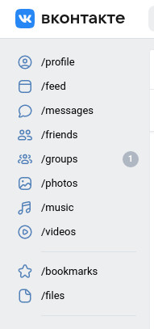
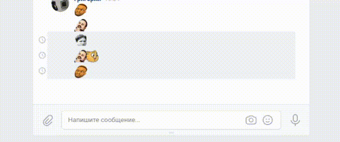

# VKTricks

Расширение для Chrome (и подобных), нацеленное на кастомизаию внешнего вида ВКонтакте.
Расширение в разработке.

## Возможности расширения:
* **Sidebar Renamer** - переименование разделов в боковой панели

</img>
* **VTwitch** - отображение emotes с Twitch в диалогах

</img>

## Установка
1. Перейти в **chrome://extensions**
2. Включить режим разработчика
3. Перетащить папку с расширением в окно браузера или выбрать её через "Загрузить распакованное расширение"
4. Всё
